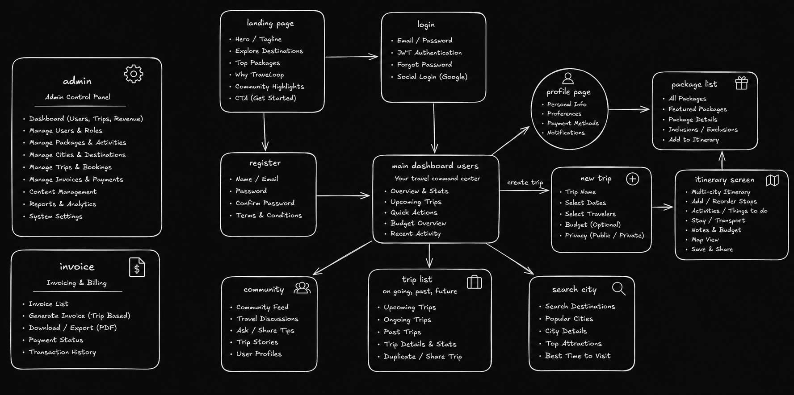
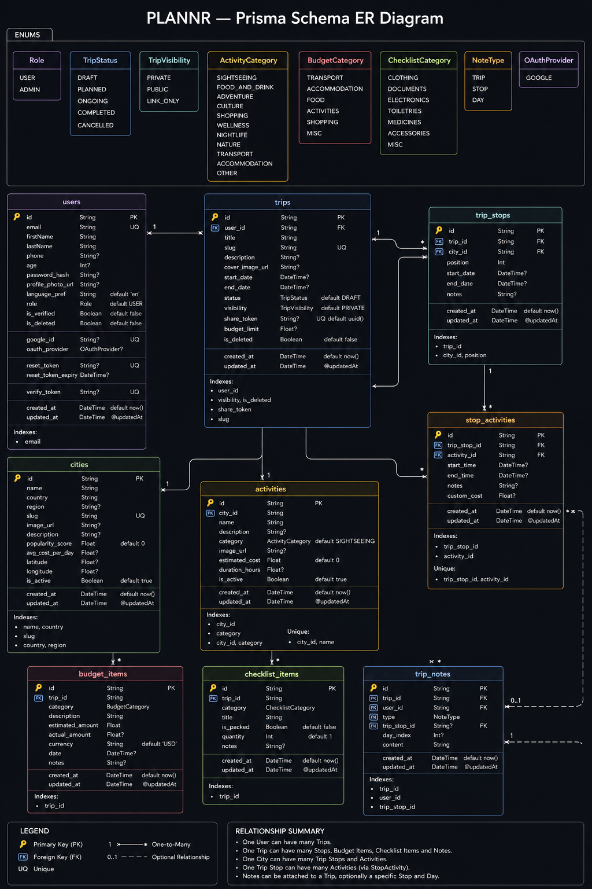

# TravelLoop

> A full-stack travel planning platform for building multi-city itineraries, managing budgets, tracking activities, and sharing trips.

🔗 **Live Demo:** [trips-plannr.vercel.app](https://trips-plannr.vercel.app)

---

## App Flow



---

## Tech Stack

| Layer      | Technology                                   |
| ---------- | -------------------------------------------- |
| Frontend   | React 19, React Router v7, Vite, Sass        |
| Backend    | Node.js, Express.js, TypeScript              |
| Database   | PostgreSQL via Prisma ORM                    |
| Auth       | JWT + Google OAuth 2.0 (Passport.js)         |
| Validation | Zod                                          |
| Utilities  | bcryptjs, Cloudinary (media), Nodemailer     |

---

## Features

- **Authentication** — Email/password + Google OAuth 2.0. JWT-based sessions. Forgot/reset password flow.
- **Trip Management** — Create, update, soft-delete, and duplicate trips with Private / Public / Link-only visibility.
- **Multi-city Itinerary Builder** — Add and reorder city stops. Attach activities with custom costs and scheduled times.
- **Budget Tracker** — Per-trip expense lines with category breakdown and over-budget warnings.
- **Packing Checklist** — Categorized list with drag-to-reorder and bulk reset.
- **Trip Notes** — Notes at the trip, stop, or day level.
- **Public Sharing** — Share via opaque token URL — no account required to view.
- **City & Activity Catalog** — Pre-seeded destinations with popularity scores, daily cost estimates, and curated activities.
- **Community Feed** — Trip stories, travel discussions, and user profiles.
- **Admin Panel** — Stats dashboard. Manage users, trips, packages, cities, bookings, and invoices.
- **Invoicing** — Generate, download (PDF), and track payment status for trip-based invoices.

---

## Database Schema



Key design decisions:

- **UUIDs** on all primary keys — safe for public URLs and distributed systems.
- **Soft deletes** (`is_deleted`) on User, Trip, and TripNote — no orphaned data.
- **Share token** (UUID) on Trip — opaque, unguessable public link.
- **Slugs** on City and Trip — clean, SEO-friendly URLs.
- **Dynamic budget totals** — calculated from `budget_items` at query time, never stored as a stale aggregate.

---

## Project Structure

```
TraveLoop_odoo/
├── frontend/               # React + Vite client
│   └── src/
│       ├── components/     # Reusable UI components
│       ├── pages/          # Route-level pages
│       └── context/        # React context providers
│
└── backend/                # Express.js API server
    ├── prisma/
    │   ├── schema.prisma   # Database schema
    │   └── seed.ts         # City & activity seed data
    └── src/
        ├── config/         # Env, Prisma client, Passport setup
        ├── features/       # Feature modules (auth, trips, stops, …)
        ├── middleware/     # Auth guard, error handler
        └── utils/          # JWT, bcrypt, response helpers
```

---

## API Overview

All endpoints return a consistent envelope:

```json
{ "success": true,  "message": "...", "data": { ... } }
{ "success": false, "message": "...", "errors": [ ... ] }
```

### Auth — `/api/v1/auth`

| Method | Route              | Auth | Description          |
| ------ | ------------------ | ---- | -------------------- |
| POST   | `/signup`          | ❌   | Register new user    |
| POST   | `/login`           | ❌   | Login, returns JWT   |
| POST   | `/logout`          | ✅   | Logout               |
| POST   | `/forgot-password` | ❌   | Send reset email     |
| POST   | `/reset-password`  | ❌   | Reset with token     |

### Trips — `/api/v1/trips`

| Method | Route       | Auth | Description              |
| ------ | ----------- | ---- | ------------------------ |
| GET    | `/`         | ✅   | Get all user trips       |
| POST   | `/`         | ✅   | Create trip              |
| GET    | `/:id`      | ✅   | Get trip with full stops |
| PATCH  | `/:id`      | ✅   | Update trip              |
| DELETE | `/:id`      | ✅   | Soft delete trip         |
| POST   | `/:id/copy` | ✅   | Deep copy trip           |

### Stops — `/api/v1/trips/:tripId/stops`

| Method | Route      | Auth | Description   |
| ------ | ---------- | ---- | ------------- |
| GET    | `/`        | ✅   | Get all stops |
| POST   | `/`        | ✅   | Add stop      |
| PATCH  | `/reorder` | ✅   | Reorder stops |
| PATCH  | `/:stopId` | ✅   | Update stop   |
| DELETE | `/:stopId` | ✅   | Remove stop   |

### Stop Activities — `/api/v1/stops/:stopId/activities`

| Method | Route  | Auth | Description              |
| ------ | ------ | ---- | ------------------------ |
| GET    | `/`    | ✅   | Get activities for stop  |
| POST   | `/`    | ✅   | Add activity to stop     |
| PATCH  | `/:id` | ✅   | Update activity instance |
| DELETE | `/:id` | ✅   | Remove activity          |

> Full route map (Cities, Budget, Checklist, Notes, Sharing, Admin) is in [`backend/Architechture.md`](./backend/Architechture.md).

---
## License

MIT
